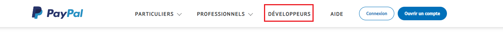
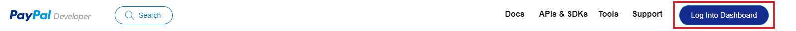
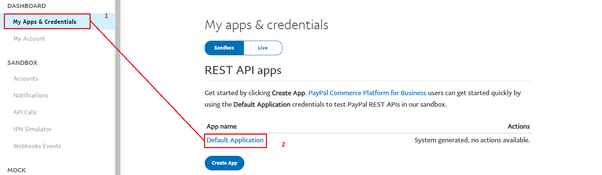

# PayPal checkout SDK

## Project
*   PHP 8.*

## How to install

*   Install Dependencies :
```
composer install 
```

* Env configuration :
```
PAYPAL_CLIENT_ID=BUSINESS-CLIENT-ID
PAYPAL_SECRET_KEY=YOU-SECRET-KEY
```
1. Go to PayPal website and click to "Développeurs"
   
2. Log into your dashboard
   
3. Find your client_id and secret key
   
4. Update **PAYPAL_CLIENT_ID** into .env by your own sandbox **Business** account app client ID.
5. Update **PAYPAL_SECRET_KEY** into .env by your own sandbox **Business** secret key.

*   Run Project :
```
php -S localhost:8000 -t public
```